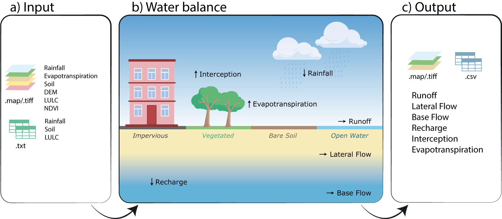

Overview
==============

.. role:: raw-html(raw)
   :format: html

**RUBEM** stands for "Rainfall rUnoff Balance Enhanced Model". It is a spatially distributed hydrological model that integrates classical hydrological processes, i.e.: the rainfall-runoff processes, evapotranspiration processes and aquifer recharge processes. Its formulation is based on the models SPHY [TERINK2015]_, WEAP [YATES2005]_, and WetSpass-M [ABDOLLAHI2017]_.

The model is written in the Python and uses the PCRaster framework [KARSSENBERG2010]_. A graphical user interface, called **RUBEM Hydrological**, that aims to facilitate configuration, execution and visualization of the results of this model  `is available as a plug-in for QGIS <https://github.com/LabSid-USP/RUBEMHydrological#readme>`_.

The following figure shows the main relevant hydrological processes present in the model. 

.. _rubem-schema:


   Model's a) inputs, b) water balance calculation and c) outputs. In b) all the hydrological processes are written in black: rainfall, interception, evapotranspiration, runoff, lateral flow, baseflow and recharge. In italic and coloured are the 4 types of soil used for land cover representation: impervious area fraction (ai), vegetated area fraction (av), bare soil area fraction (as) and open water area fraction (ao).

The following sections summarize the model input data as shown in the figure above.

Main Features
--------------

The model was developed based on classical concepts of hydrological processes and equations based mainly on the formulations of SPHY models [TERINK2015]_, WEAP [YATES2005]_, and WetSpass-M [ABDOLLAHI2017]_. The main features of the developed model are:

- Distributed monthly step model;
- Hydrological process based on soil water balance in each pixel, and flow total calculated after composition of the resulting accumulated flow, according to Direction drainage network flow established by the digital elevation model (DEM);
- Calculations for two zones: rootzone and saturated;
- Evapotranspiration and interception process based on vegetation index: Leaf Area Index (LAI), Photosynthetically Active Radiation Fraction (FPAR) and Normalized Difference Vegetation Index (NDVI); and
- Sub-pixel level coverage classification, represented by four fractions that represent percentage of total pixel area covered exclusively by: area vegetated, bare soil area, water area and impervious area.


Model Formulation
-----------------

RUBEM is a spatially distributed hydrological model that integrates classical rainfall-runoff processes. The water balance in the soil layer considers the interception, evapotranspiration, lateral flows, and aquifer recharge. The model integrates classical rainfall-runoff processes, i.e.: the interception evapotranspiration, surface runoff, lateral flows, baseflow, groundwater recharge, and water balance in the soil. Input data are the Normalized Difference Vegetation Index (NDVI), Land Use Land Cover (LULC), weather, rainfall, and soil, including the digital elevation model (DEM).

Interception
`````````````

Interception is the fraction of precipitation which is retained by the vegetated area canopy. Therefore, its calculation is based on the vegetation cover characteristics, incorporated into the equations through the indexes Fraction of Absorbed Photosynthetically Active Radiation (FPAR), Normalized Difference Vegetation Index (NDVI), and Leaf Area (LAI). Equation :eq:`interception` shows the interception calculation. 

.. math::
   :label: interception
   :nowrap:
    
    \[I = \alpha_V \cdot I_V\]

where:

- :math:`I` - Interception (mm);
- :math:`I_V`- Interception at the vegetated area (mm);
- :math:`\alpha_V`- Vegetated area fraction (%).

:math:`I_V` is calculated through the :math:`I_R` :eq:`interception-v` and :math:`I_D` :eq:`interception-d` indexes, based on FPAR :eq:`fpar`, NDVI and LAI. The values of LAI :eq:`lai` are estimated through the FPAR value, which are in turn calculated from NDVI values, obtained through satellite images, according to [PENG2012]_, and [ABDOLLAHI2017]_.


.. math::
   :label: interception-v   
   :nowrap:
    
    \[I_V = P_m \cdot I_R\]

.. math::
   :label: interception-r
   :nowrap:
    
    \[I_R = 1 - \exp{\left( -\frac{I_D \cdot d_p}{P_m} \right)}\]

.. math::
   :label: interception-d
   :nowrap:
    
    \[I_D = \alpha \cdot LAI \cdot \exp{\left( 1 - \frac{1}{1 + \frac{P_m \cdot [1 - \exp{(-0.463 \cdot LAI)}]}{\alpha \cdot LAI}} \right)}\]

.. math::
   :label: lai
   :nowrap:
    
    \[LAI = LAI_{max} \cdot \frac{\log{(1-FPAR)}}{\log{(1-FPAR_{max})}} \]

.. math::
   :label: fpar
   :nowrap:
    
    \[FPAR = \min{\left[ \frac{(SR-SR_{min})(FPAR_{max}-FPAR_{min})}{SR_{max}-SR_{min}} + FPAR_{min}, \: 0.95\right]} \]

.. math::
   :label: sr
   :nowrap:
    
    \[SR = \frac{1 + NDVI}{1 - NDVI} \]

where:

- :math:`I_R`- Interception rate, dependant on land cover characteristics, represented by the Leaf Area Index (LAI) (mm);
- :math:`P_m` - Total monthly precipitation (mm);
- :math:`d_P` - Number of rainy days in the month (days);
- :math:`I_D` - Minimum threshold for daily interception depends on the canopy storage capacity. Its calculation is associated with the LAI (mm);
- :math:`LAI` - Leaf Area Index (-);
- :math:`\alpha` - Interception calibration parameter.
- :math:`FPAR` - Fraction Photosynthetically Active Radiation (-);
- :math:`FPAR_{min}`, :math:`FPAR_{max}` - minimum and maximum values for FPAR (0.001 and 0.95, respectively), corresponding to the minimum and maximum values for LAI for a particular vegetation class.

.. note:: 

   If :math:`P_m = 0` then :math:`I_R = 0`.


Evapotranspiration
```````````````````

Evapotranspiration refers to the transfer of water from the soil-plant system to the atmosphere. Actual evapotranspiration is calculated based on the sum of evapotranspiration values for each sub-pixel level coverage classification fraction (vegetation, bare soil, water, and impervious soil). Each evapotranspiration fraction is estimated by the concept of potential evapotranspiration [ABDOLLAHI2017]_. The potential evapotranspiration values are an input calculated in this study using the Penman-Montheit method [ALLEN2018]_. The following equations presents the calculation process.


.. math::
   :label: etreal
   :nowrap:
    
    \[ET_{REAL} = \alpha_V \cdot ET_{R,V} + \alpha_{SN} \cdot ET_{R,S} + \alpha_A \cdot ET_{R,A} + \alpha_I \cdot ET_{R,I}\]

where:

- :math:`ET_{REAL}` – Total real evapotranspiration (mm);
- :math:`ET_{R,V}` – Real evapotranspiration at the vegetated area (mm);
- :math:`ET_{R,S}` – Real evapotranspiration at the bare soil area (mm);
- :math:`ET_{R,A}` – Real evapotranspiration at the water area (mm);
- :math:`ET_{R,I}` – Real evapotranspiration at the impervious area (mm);
- :math:`\alpha_V` – Vegetated area fraction (%);
- :math:`\alpha_S` – Bare soil area fraction (%);
- :math:`\alpha_A` – Water area fraction (%);
- :math:`\alpha_I` – Impervious area fraction (%).

.. note:: 

   If :math:`\alpha_A = 1` and :math:`ET_{R,A} > P_m` then :math:`ET_{R,A} = P_m`.


Vegetated Area Fraction
''''''''''''''''''''''''

.. math::
   :label: etrv
   :nowrap:
    
   \[ET_{R,V} = ET_p \cdot kc \cdot ks\]

.. math::
   :label: kc    
   :nowrap:
    
   \[kc = kc_{min} + (kc_{max} - kc_{min}) \cdot \left( \frac{NDVI-NDVI_{min}}{NDVI_{max}-NDVI_{min}} \right)\]

where:

- :math:`ET_p` – Potential evapotranspiration (mm);
- :math:`kc` – Crop coefficient (-);
- :math:`ks` – Soil moisture reduction coefficient (-).
- :math:`NDVI` - Normalized Difference Vegetation Index (-).

.. note::

   If :math:`NDVI \leq 1.1 \cdot NDVI_{min}` then :math:`kc = kc_{min}`.


Bare Soil Area Fraction
''''''''''''''''''''''''

.. math::
   :label: etrs    
   :nowrap:
    
    \[ET_{R,S} = ET_p \cdot kc_{min} \cdot ks\]

.. math::
   :label: ks    
   :nowrap:
    
    \[ks = \frac{\ln{(TU_R - TU_{PM} + 1)}}{\ln{(TU_{CC} - TU_{PM} + 1)}} \]

where:

- :math:`ET_p` – Potential evapotranspiration (mm);
- :math:`kc` – Crop coefficient (-);
- :math:`ks` – Soil moisture reduction coefficient (-);
- :math:`TU_{PM}` – Moisture content of the soil at the wilting point (mm);	
- :math:`TU_{CC}` – Moisture content of the soil at field capacity (mm);
- :math:`TU_R` – Actual moisture content of the soil (mm).

.. note::

   If :math:`TU_R < TU_{PM}` then :math:`ks = 0`.


Water Area Fraction
''''''''''''''''''''

.. math::
   :label: etra    
   :nowrap:
    
    \[ET_{R,A} = \frac{ET_p}{kp}\]

.. math::
   :label: kp    
   :nowrap:
    
    \[kp = 0.482 + 0.024 \cdot \ln{(B)} - 0.000376 \cdot U_2 + 0.0045 \cdot UR \]

where:

- :math:`ET_p` – Potential evapotranspiration (mm);
- :math:`kp` – Pan Coefficient (-).

Impervious Area Fraction
''''''''''''''''''''''''

.. math::
   :label: etri    
   :nowrap:
    
    \[ET_{R,I} = I_I\]

where:

- :math:`I_I` – Interception for impervious areas (3 -5 mm);
- :math:`ET_{R,I}` – Real evapotranspiration at the impervious area (mm).

Surface Runoff
```````````````
Surface runoff refers to the water that flows on the cell surface. The monthly calculation of surface runoff is based on the rational method, considering two flow coefficients, as shown in equation :eq:`surfacerunoff` [ABDOLLAHI2017]_.

.. math::
   :label: surfacerunoff    
   :nowrap:
    
    \[SR = C_{SR} \cdot C_h \cdot (P_m - I) \]

where:

- :math:`SR` – Surface runoff (mm);
- :math:`C_{SR}` – Real runoff coefficient (-);
- :math:`C_h` – Coefficient related to soil moisture (-);
- :math:`P_m` – Total monthly precipitation (mm);
- :math:`I`– Total interception (mm).

:math:`C_{SR}` is a real flow coefficient, obtained through a flow coefficient which considers pervious and impervious areas and adjusted by the mean monthly precipitation. :math:`C_h` is related to soil moisture conditions. When the soil is saturated at the current time step, surface runoff is calculated as the difference between precipitation and interception.


.. math::
   :label: csr       
   :nowrap:
    
    \[C_{SR} = \frac{C_{wp} \cdot \overline{P}_{MD}}{C_{wp} \cdot \overline{P}_{24} - RCD \times C_{wp} + RCD} \]

.. math::
   :label: cwp    
   :nowrap:
    
    \[C_{wp} = (1 - A_{imp}) \cdot C_{per} + A_{imp} \cdot C_{imp} \]

.. math::
   :label: cimp    
   :nowrap:
    
    \[C_{imp} = 0.09 \cdot \exp{(2.4 \cdot A_{imp})} \]

.. math::
   :label: aimp    
   :nowrap:
    
    \[A_{imp} = \alpha_O + \alpha_I \]

.. math::
   :label: cper    
   :nowrap:
    
    \[C_{per} = w_1 \left(\frac{0.02}{n} \right) + w_2\left(\frac{\theta_{PM}}{1-\theta_{PM}} \right) + w_3\left(\frac{S}{10+S} \right) \]

.. math::
   :label: ch    
   :nowrap:
    
    \[C_h = \left(\frac{\theta_{TUR}}{\theta_{POR}} \right)^b \]

.. math::
   :label: thetatur    
   :nowrap:
    
    \[\theta_{TUR} = \frac{TU_R}{d_g \cdot Z_r \cdot 10}\]


where:

- :math:`SR` – surface runoff in the cell (mm);
- :math:`C_{SR}` – actual flow coefficient (-);
- :math:`C_h` – coefficient related to soil moisture (-);
- :math:`P_m` – total monthly precipitation (mm);
- :math:`I` – total interception total (mm);
- :math:`\overline{P}_{MD}` – average daily rain on rainy days (:raw-html:`mm day<sup>-1</sup>month<sup>-1</sup>`);
- :math:`RCD` – regional consecutive dryness factor [parameter to be calibrated] (mm);
- :math:`C_{wp}` – potential runoff coefficient (-);
- :math:`C_{imp}` – potential runoff coefficient of impermeable areas, empirical relationship (-);
- :math:`C_{per}` – potential runoff coefficient of permeable areas (-);
- :math:`A_{imp}` – total fraction of impermeable area per cell (-);
- :math:`w1`, :math:`w2` e :math:`w3` – Weights for the three components related to runoff: cover, soil and slope characteristics [parameter to be calibrated] (-);
- :math:`n` – Manning roughness (-);
- :math:`\theta_{PM}` – root layer wilting point volumetric content (-);
- :math:`S` – terrain slope in each cell (%);
- :math:`\theta_{TUR}` – volumetric moisture content of the root layer (-);
- :math:`\theta_{POR}` – volumetric porosity content of the root layer (-);
- :math:`b` – calibration exponent, ranges between 0 and 1 [parameter to be calibrated] (-);
- :math:`TU_R` – moisture content for the root zone (mm);
- :math:`d_g` – overall soil density in the root layer (:raw-html:`g cm<sup>3</sup>`);
- :math:`Z_r` – root layer thickness (cm).

.. note:: 

   If :math:`\theta_{TUR} > \theta_{POR}` then :math:`\theta_{TUR} = \theta_{POR}`. 

.. note::

   If :math:`\alpha_A = 1` then :math:`SR = P_m - ET_{R,A}`.


Lateral Flow
`````````````

Lateral flow occurs in the unsaturated layer under the surface of the soil. The groundwater recharge is the downflow from the surface to the water aquifer by infiltration and deep percolation. Lateral flow and groundwater recharge (equations below) are calculated by values of root zone moisture, hydraulic conductivity, and a calibrated partitioning coefficient, which controls horizontal and vertical flow [YATES2005]_.

.. math::
   :label: lateralflow     
   :nowrap:
    
    \[LF = f \cdot K_R \cdot \left( \frac{TU_R}{TU_{SAT}} \right)^2 \]

where:

- :math:`LF` – Lateral flow (mm);
- :math:`f` – Vertical and horizontal flow partitioning coefficient (-);
- :math:`K_R` – Root zone hydraulic conductivity coefficient (mm/month);
- :math:`TU_R` – Root zone moisture content (mm);
- :math:`TU_{SAT}` – Root zone moisture content at saturation (mm).

Aquifer Recharge
`````````````````

Groundwater recharge is complementary to lateral flow, and is calculated as follows :eq:`recharge`:

.. math::
   :label: recharge    
   :nowrap:
    
    \[REC = (1-f) \cdot K_R \cdot \left( \frac{TU_R}{TU_{SAT}} \right)^2 \]

where:

- :math:`REC` – Recharge (mm);
- :math:`f` – Vertical and horizontal flow partitioning coefficient (-);
- :math:`K_R` – Root zone hydraulic conductivity coefficient (mm/month);
- :math:`TU_R` – Root zone moisture content (mm);
- :math:`TU_{SAT}` – Root zone moisture content at saturation (mm).

.. _baseflow-overview-section:

Baseflow
`````````

The basic flow is the one that occurs in the saturated soil layer. The base flow is determined by [TERINK2015]_ by groundwater recharge and the recession coefficient. It is calculated only if the moisture content in the saturated zone exceeds a specified threshold.

.. math::
   :label: baseflow      
   :nowrap:
    
    \[
    BF = \left\{
            \begin{array}{ll}
            0,  & \mbox{if } TU_S \leq BF_{thresh} \\
            BF_{T-1} \cdot e^{-\alpha_{GW}} + (1-e^{-\alpha_{GW}}) \cdot REC,  & \mbox{if } TU_S > BF_{thresh} \\
            \end{array}
    \right. 
    \]

where:

- :math:`BF` – Baseflow (mm);
- :math:`BF_{T-1}` – Baseflow at the previous time step (mm);
- :math:`\alpha_{GW}` – Baseflow decay coefficient (-) [parameter to be calibrated];
- :math:`REC` – Recharge (mm);
- :math:`TU_S` – Saturated zone moisture content (mm);
- :math:`BF_{thresh}` – Threshold baseflow, attributed for each watershed (mm).

Water Balance
``````````````

RUBEM is governed by the mass balance for the water in the soil layer. Soil moisture at the root and saturated zones are calculated through a water balance equation on each respective layer according to equations :eq:`pe`, :eq:`tus` and :eq:`tur`.


.. math::
   :label: pe     
   :nowrap:
    
    \[P_E = P_m - I\]

where:

- :math:`P_E` – Effective precipitation (mm);
- :math:`P_m` – Total Monthly precipitation (mm);
- :math:`I` – Total interception (mm).
  
.. math::
   :label: tus     
   :nowrap:
    
    \[TU_S = TU_{S,T-1} - BF + REC \]

where:

- :math:`TU_S` – Saturated zone moisture content (mm);
- :math:`TU_{S,T-1}` – Saturated zone moisture content at the previous time step (mm);
- :math:`BF` – Baseflow (mm).

.. math::
   :label: tur     
   :nowrap:
    
    \[TU_R = TU_{R,T-1} + P_E - SR - LF - REC - ET_{REAL} \]

where:

- :math:`TU_R` – Root zone moisture content (mm);
- :math:`TU_{R,T-1}` – Root zone moisture content at the previous time step (mm);
- :math:`SR` – Surface runoff (mm);
- :math:`LF` – Lateral flow (mm);
- :math:`REC` – Recharge (mm);
- :math:`ET_{REAL}` – Total real evapotranspiration (mm).

.. note:: 

   If :math:`\alpha_A = 1` then :math:`TU_R = TU_{SAT}`.

In the root zone, the surface runoff relies on the soil moisture conditions, based on the lateral flow, recharge, and evapotranspiration. The saturated zone of the soil affected the calculation of the base flow and recharge parameters. The water balance equation adopted in RUBEM aims to calculate the total superficial flow.

Total Discharge
````````````````

Total Discharge corresponds to the contribution of the flows produced in each cell. It is computed at the grid level of the model, and the total flow is computed using the Digital Elevation Model to generate the Local Drainage Direction (LDD). The superficial flow is computed at any grid cell, Equation :eq:`qt`, and the total flow is computed using an aggregate result according to the LDD [KARSSENBERG2010]_; [TERINK2015]_.

Total superficial discharge, Equation :eq:`qtot`, is the sum of flow components: surface runoff (SR), lateral flow (LF), and baseflow (BF) [ABDOLLAHI2017]_.


.. math::
   :label: qtot    
   :nowrap:
    
    \[Q_{Tot} = SR + LF + BF \]

.. math::
   :label: qt    
   :nowrap:
    
    \[Q_t = x \cdot Q_{t-1} + \frac{0.001 \cdot (1 - x) \cdot A \cdot Q_{Tot}}{days \cdot 24 \cdot 3600} \]

where:

- :math:`Q_{Tot}` – Total pixel runoff (mm);
- :math:`SR` – Surface runoff (mm);
- :math:`LF` – Lateral flow (mm);
- :math:`BF` – Baseflow (mm);
- :math:`Q_t` – Total pixel flow (:raw-html:`m<sup>3</sup>s<sup>-1</sup>`);
- :math:`Q_{t-1}` – Total pixel flow at the previous time step (:raw-html:`m<sup>3</sup>s<sup>-1</sup>`);
- :math:`A` – Pixel area (:raw-html:`m<sup>2</sup>`);
- :math:`x` – Damping coefficient (-).

The model operates on a monthly basis and calculates the water balance cell-by-cell. Local Drainage Direction (LDD) is then calculated based on the Digital Elevation Model (DEM), which is used for obtaining the total discharge.

.. Rainfall data
.. ``````````````

.. .. math::
..    :label: y    
..    :nowrap:
    
..     \[Y = a + b_1 \cdot X_1 + b_2 \cdot X_2 + \dots + b_n \cdot X_n \]

.. .. math::
..    :label: a    
..    :nowrap:
    
..     \[a = \frac{\sum{Y} \cdot \sum{X^2} - \sum{X} \cdot \sum{XY}}{N \cdot \sum{X^2}-(\sum{X})^2}\]

.. .. math::
..    :label: b    
..    :nowrap:
    
..     \[b = \frac{N\sum{XY} - \sum{X} \cdot \sum{Y}}{N \cdot \sum{X^2}-(\sum{X})^2}\]

.. Streamflow Data
.. ````````````````

.. .. math::
..    :label: qy    
..    :nowrap:
    
..     \[Q_Y = Q_X \cdot \left(\frac{A_Y}{A_X} \right)^m \cdot \left( \frac{P_Y}{P_X} \right)^n\]

.. .. math::
..    :label: fo    
..    :nowrap:
    
..     \[F.O. =  \min{\left[\sum{(Q_{Y_{obs}}-Q_{Y_{est}})^2} \right]}\]

.. .. math::
..    :label: qya    
..    :nowrap:
    
..     \[Q_Y = a \cdot Q_X\]

.. .. math::
..    :label: r    
..    :nowrap:
    
..     \[r = \frac{\sum{(Q_X - \overline{Q_X}) \cdot (Q_Y-\overline{Q_Y})}}{\sqrt{\sum{(Q_X - \overline{Q_X})^2} \cdot \sum{(Q_Y-\overline{Q_Y})^2}}}\]

Calibration and Validation
---------------------------

RUBEM calibration is based on 9 parameters as described in the table below. Their range is defined according to the watershed physical features (soil and rainfall) and literature review [TERINK2015]_; [ABDOLLAHI2017]_ and [WANG2018]_.

+-----------------------------------+----------------------------------------------+--------------------------------+
| Parameter                         | Description                                  | Restriction                    |
+===================================+==============================================+================================+
| Interception                      | Interception parameter value. Represents the | :math:`0.01 ≤ \alpha ≤ 10`     |
|                                   |                                              |                                |
| Parameter (:math:`\alpha`)        | daily interception threshold that depends on |                                |
|                                   |                                              |                                |
|                                   | land use.                                    |                                |
+-----------------------------------+----------------------------------------------+--------------------------------+
| Rainfall Intensity                | Exponent value representing the effect of    | :math:`0.01 ≤ b ≤ 1`           |
|                                   |                                              |                                |
| Coefficient (:math:`b`)           | rainfall intensity in the runoff.            |                                |
+-----------------------------------+----------------------------------------------+--------------------------------+
| Land Use Factor                   | Weight of land use factor. It measures the   | :math:`w_1 + w_2 + w_3 = 1`    |
|                                   |                                              |                                |
| Weight (:math:`w_1`)              | effect of the land use in the potential      |                                |
|                                   |                                              |                                |
|                                   | runoff produced.                             |                                |
+-----------------------------------+----------------------------------------------+--------------------------------+
| Soil Factor                       | Weight of soil factor. It measures the       | :math:`w_1 + w_2 + w_3 = 1`    |
|                                   |                                              |                                |
| Weight (:math:`w_2`)              | effect of the soil classes in the potential  |                                |
|                                   |                                              |                                |
|                                   | runoff produced.                             |                                |
+-----------------------------------+----------------------------------------------+--------------------------------+
| Slope Factor                      | Weight of slope factor. It measures the      | :math:`w_1 + w_2 + w_3 = 1`    |
|                                   |                                              |                                |
| Weight (:math:`w_3`)              | effect of the slope in the potential         |                                |
|                                   |                                              |                                |
|                                   | runoff produced.                             |                                |
+-----------------------------------+----------------------------------------------+--------------------------------+
| Regional Consecutive              | Regional Consecutive Dryness level,          | :math:`1 ≤ RCD ≤ 10`           |
|                                   |                                              |                                |
| Dryness Level (:math:`RCD`)       | incorporates the intensity of rain and the   |                                |
|                                   |                                              |                                |
|                                   | number of consecutive days in runoff         |                                |
|                                   |                                              |                                |
|                                   | calculation.                                 |                                |
+-----------------------------------+----------------------------------------------+--------------------------------+
| Flow Direction                    | Used to partition the flow out of the root   | :math:`0.01 ≤ f ≤ 1`           |
|                                   |                                              |                                |
| Factor (:math:`f`)                | zone between interflow and flow to the       |                                |
|                                   |                                              |                                |
|                                   | saturated zone.                              |                                |
+-----------------------------------+----------------------------------------------+--------------------------------+
| Baseflow Recession                | Decimal value referring to the recession     | :math:`0.01 ≤ \alpha_{GW} ≤ 1` |
|                                   |                                              |                                |
| Coefficient (:math:`\alpha_{GW}`) | coefficient of the baseflow.                 |                                |
+-----------------------------------+----------------------------------------------+--------------------------------+
| Flow Recession                    | Flow recession coefficient value, it         | :math:`0 ≤ x ≤ 1`              |
|                                   |                                              |                                |
| Coefficient (:math:`x`)           | incorporates a flow delay in the accumulated |                                |
|                                   |                                              |                                |
|                                   | amount of water that flows out of the cell   |                                |
|                                   |                                              |                                |
|                                   | into its neighboring downstream cell.        |                                |
+-----------------------------------+----------------------------------------------+--------------------------------+

For calibration purposes, the Differential Evolution algorithm [STORN1997]_ can be used. The method executes three operations for candidate choice, mutation, crossing and selection. For each basin, spatialized distributed stream gauges have to be considered. The choice criteria must include series with few flaws, location in the basin, LULC, and rainfall regimes.

Traditional indexes and statistics can be used to evaluate the accuracy of the results. Root Mean Square Error – RMSE and Nash-Sutcliffe Efficiency – NSE are examples. 

.. The best group of parameters is revealed through 3 objective functions: Pearson coefficient, Root Mean Square Error (RMSE) and Nash-Sutcliffe Efficiency (NSE). They are calculated as following:

.. .. math::
..    :label: rpearsoncoef    
..    :nowrap:
    
..     \[R = \frac{\sum_{1}^{n}{(Q_O - \overline{Q_O}) \cdot (Q_S-\overline{Q_S})}}{\sqrt{\sum_{1}^{n}{(Q_O - \overline{Q_O})^2} \cdot \sum{(Q_S-\overline{Q_S})^2}}}\]

.. where:

.. - :math:`R`– Pearson correlation coefficient;
.. - :math:`x_i` – Values of the :math:`x` variable in the sample;
.. - :math:`\overline{x}`– Mean of the values of the :math:`x` variable;
.. - :math:`y_i` – Values of the :math:`y` variable in the sample;
.. - :math:`\overline{y}`– Mean of the values of the :math:`y` variable.

.. .. math::
..    :label: rmse   
..    :nowrap:
    
..     \[RMSE = \sqrt{\frac{\sum_{1}^{n}{(Q_S - Q_O)^2}}{N}} \]

.. where:

.. - :math:`RMSE` – Root mean square error;
.. - :math:`y_i` – Simulated values;
.. - :math:`y_i` – Observed values;
.. - :math:`n` – Number of values.

.. .. math::
..    :label: nse   
..    :nowrap:
    
..     \[NSE = 1 - \frac{\sum_{1}^{n}{(Q_O - Q_S)^2}}{\sum_{1}^{n}{(Q_O - \overline{Q_O})^2}} \]

.. where:

.. - :math:`NSE` – Nash-Sutcliffe efficiency coefficient;
.. - :math:`x_i`– Simulated values;
.. - :math:`y_i`– Observed values;
.. - :math:`\overline{y_i}`– Mean of the observed values.

.. .. math::
..    :nowrap:
    
..     \[\overline{e} = \frac{\sum_{1}^{n}{(Q_S - Q_O)}}{N} \]

.. .. math::
..    :nowrap:
    
..     \[r_v = \frac{\overline{e}}{\overline{Q_O}} \]

.. .. math::
..    :nowrap:
    
..     \[F_{ij} = \frac{z_{ij}-z_{i_{pior}}}{z_{i_{melhor}}-z_{i_{pior}}} \]

.. .. math::
..    :nowrap:
    
..     \[GF = \sqrt[n]{F_1 \cdot F_2 \cdot \: \dots \: \cdot F_n} \]


References
----------

.. [ABDOLLAHI2017] Abdollahi, K., Bashir, I., Harouna, M., Griensven, A., Huysmans, M., Batelaan, O., Verbeiren, B., A distributed monthly water balance model: formulation and application on Black Volta Basin, Environ Earth Sci, 76:198, 2017.

.. [ALLEN2018] Allen, M., Dube, O. P., Solecki, W., Aragón-Durand, F., Cramer, W., Humphreys, S., ... & Mulugetta, Y. (2018). Global warming of 1.5° C. An IPCC Special Report on the impacts of global warming of 1.5° C above pre-industrial levels and related global greenhouse gas emission pathways, in the context of strengthening the global response to the threat of climate change, sustainable development, and efforts to eradicate poverty. Sustainable Development, and Efforts to Eradicate Poverty.

.. [KARSSENBERG2010] Karssenberg, D., Schmitz, O., Salamon, P., de Jong, K., and Bierkens, M. F. P.: A software framework for construction of process-based stochastic spatio-temporal models and data assimilation, Environmental Modelling & Software 25(4), 489-502, 2010. doi: 10.1016/j.envsoft.2009.10.004.

.. [MACHADO2017] Machado, A.R. (2017). Alternativas de restauração de florestas ripárias para o fornecimento de serviços ecossistêmicos. 149 p. Tese (Doutorado em Engenharia de Recursos Hídricos) – Escola politécnica, Universidade de São Paulo, São Paulo, 2017.

.. [MCCUEN2006] McCuen, R.H.; Knight, Z; Cutter, A.G. (2006). "Evaluation of the Nash–Sutcliffe efficiency index". Journal of Hydrologic Engineering. v. 11, n. 6, 2006.

.. [OLIVOS2017] Olivos, L.M. (2017). Sustentabilidade do uso de recursos hídricos superficiais e subterrâneos no município de São Carlos, SP. 2017. Dissertação (Mestrado em Recursos Hídricos) – Escola Politécnica, Universidade de São Paulo, São Paulo, Brazil.

.. [PENG2012] Peng, D.; Zhang, B.; Liu, L. Comparing spatiotemporal patterns in Eurasian FPAR derived from two NDVI based methods. International Journal of Digital Earth, v. 5, n. 4, p. 283-298, 2012

.. [RITTER2013] Ritter, A.; Muñoz-Carpena, R. (2013). "Performance evaluation of hydrological models: statistical significance for reducing subjectivity in goodness-of-fit assessments". Journal of Hydrology. 480 (1): 33–45

.. [SINGH2004] Singh, J., Knapp, H.V., Demissie, M. (2004). Hydrologic modeling of the Iroquois River watershed using HSPF and SWAT. 2004. Illinois State Water Survey Contract Report 2004-08. Illinois Department of Natural Resources: Illinois State Geological Survey.

.. [STORN1997] Storn, R., Price, K. (1997). Differential Evolution – A simple and efficient heuristic for global optimization over Continuous spaces. Journal of Global Optimization, v. 11 p. 341–359.

.. [TENA2019] Tena, T.M.; Mwaanga, P.; Nguvulu, A. (2019). Hydrological modelling and water resources assessment of Chongwe River Catchment using WEAP model. Water, v. 11, p. 839-856

.. [TERINK2015] Terink, W., Lutz, A. F., Simons, G. W. H., Immerzeel, W. W., & Droogers, P. (2015). SPHY v2.0: Spatial Processes in HYdrology. Geoscientific Model Development, 8(7), 2009–2034. https://doi.org/10.5194/gmd-8-2009-2015

.. [YATES2005] Yates, D., Sieber, J., Purkey, D., & Huber-Lee, A. (2005). WEAP21—A Demand-, Priority-, and Preference-Driven Water Planning Model. Water International, 30(4), 487–500. https://doi.org/10.1080/02508060508691893

.. [WANG2018] Wang, L., Wang, Z., Liu, C., Bai, P., & Liu, X. (2018). A Flexible Framework HydroInformatic Modeling System—HIMS. Water, 10(7), 962. https://doi.org/10.3390/w10070962