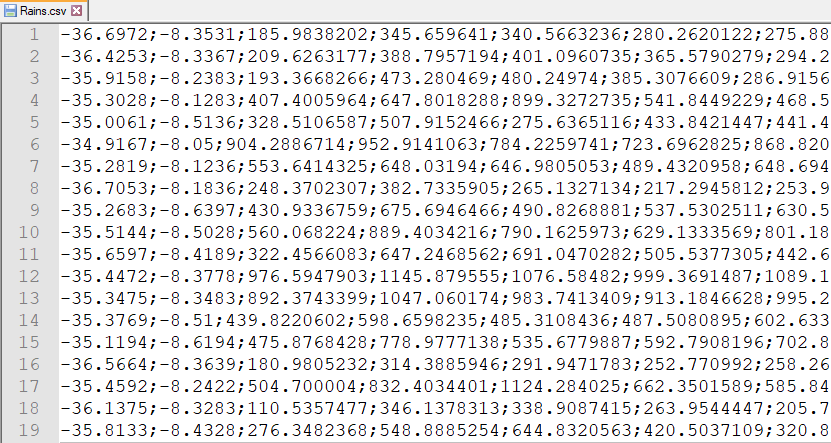

Data Pre-processing
===================

RUBEM model applications require data input at a specific format and quantity. This manual provides the steps for using the preprocessing scripts to prepare model data for the RUBEM model. The scripts described here are available in the `RUBEM repository on GitHub <https://github.com/LabSid-USP/RUBEM>`__. We recommend that you use a specific Conda environment for this step.

Conda Environment 
------------------

A conda environment is used to run the scripts available for preprocessing. A :file:`conda_env.yml` file is available for creating the environment with necessary libraries and packages for running all scripts. For more details see the `related documentation. <https://conda.io/projects/conda/en/latest/user-guide/tasks/manage-environments.html#creating-an-environment-from-an-environment-yml-file>`__

Use the terminal or an Anaconda Prompt for the following steps:

1. Create the environment from the environment.yml file:

.. code-block:: console

    conda env create -f conda_env.yml

Activate the new environment: 

.. code-block:: console

    conda activate myenv

Verify that the new environment was installed correctly:

.. code-block:: console

    conda env list

Available Scripts
------------------

TIFF/GeoTIFF to PCRaster Map File Format
````````````````````````````````````````

The function of the script allows to convert a file in format :file:`.tif` to a :file:`.map` file.

.. note::
    
    The model requires input rasters to be in PCRaster map format, each file also has to match the appropriate PCRaster value format, see :doc:`File Formats </fileformats>` for more information. 

For correct output file format code, change the line 55 (``outputType``) from :file:`preprocessing/tif2map.py` must be modified according to table follows:

+-------------+--------------------+
| Soutce type | Target value scale |
+=============+====================+
| GDT_Byte    | VS_BOOLEAN         |
+-------------+--------------------+
| GDT_Int32   | VS_NOMINAL         |
+-------------+--------------------+
| GDT_Float32 | VS_SCALAR          |
+-------------+--------------------+
| GDT_Float64 | VS_SCALAR          |
+-------------+--------------------+

Call the function as shown:

.. code-block:: python
    
    tif2map('/path/to/files/to/be/converted')

TIFF/GeoTIFF to PCRaster Tss File Format
````````````````````````````````````````

The function of the script allows to convert a serie of :file:`.tif` to pcraster map-series at format :file:`*.001`, :file:`*.002` .... These maps represent the meteorological forcing map-series, that are series of input maps with the time step indicated in each filename. The filenames have a strict format with 8 characters before a dot (.), and three characters after the dot.

Call the function as shown:

.. code-block:: python
    
    myModel= tif2pcrTss('/path/to/tiff/series','run','/path/to/clone.map')

First argument folder must have an structure as follows:

.. code-block:: console

    +---series      
    |   etp1.tif
    |   etp2.tif
    |   etp3.tif
    ...

Define second argument as "run" output files look like follow:

.. code-block:: console
    
    +---series      
    |   run00000.001
    |   run00000.001
    |   run00000.001
    ...


Third argument must be a file in format ``VS_BOOLEAN`` :file:`.map` and ``nrOfTimeSteps`` must match the number of files to be converted (e.g. 8 files of ``etp``, ``nrOfTimeSteps = 8``).

PCRaster Tss File Format to TIFF/GeoTIFF
````````````````````````````````````````

The function of the script allows to convert a serie of pcraster map-series at format :file:`*.001`, :file:`*.002` ... to :file:`*.tif` file format.

Call the function as shown:

.. code-block:: python
    
    pcrTss2Tif('/path/to/files/to/be/converted', '/path/to/DEM.tif')

First argument folder must have an structure as follows:

.. code-block:: console
    
    +---series      
    |   run00000.001
    |   run00000.001
    |   run00000.001
    ...

Second argument corresponds to the Digital Elevation Model in :file:`*.tif` format used to get mask coordinates, projection and driver information for the conversion.

Get Maximum and Minimum Value Map
``````````````````````````````````

This script allows you to get a map for variables as Minimum NDVI and Maximum NDVI from an historical series of files in :file:`*.tif` format. To run the script, the following variables must be setted:

.. code-block:: python
    
    Input_path =  'Directory containing the files'
    dem_source = 'Path to Digital Elevation Model (DEM) with same resolution and size that input_path files'
    outpath_min = 'Path and name minimum output file, example=/path/ndvi_min.tif'
    outpath_max = 'Path and name maximum output file, example=/paht/ndvi_max.tif'
 
``Input_path`` folder must have an structure as follows:

.. code-block:: console
    
    +---series      
    |   etp1.tif
    |   etp2.tif
    |   etp3.tif
    ...

Kriging Method
``````````````

The RUBEM model uses meteorological forcing variables as precipitation and evapotranspiration. In general, meteorological data is available for specific locations (stations). This script allows you to generate spatialized maps for the variable from discrete data using the kriging method.

Call the function as shown:

.. code-block:: python
    
    Krige_Interpolation('/path/for/output/files/','/path/and/filename/dem.map','/path/and/filename/CSV/file/data.csv')

The first argument corresponds to the folder to store the maps generated. The second argument corresponds to the Digital Elevation Model in :file:`*.tif` format used to get mask coordinates, projection and resolution for the files created.

The third argument must be a file in format :file:`*.csv`, each row corresponds to one station data. First and second columns correspond to station Longitude and Latitude, others columns contain data for each timestep. Figure below shows an example of the format of the file.



----------

To use this script, the following conditions must be met:

- A minimum of 3 stations data is mandatory;
- No value data is not allowed;
- Projection of station coordinates must correspond to DEM projection;
- ``nrOfTimeSteps`` must be minor or equal to the number of columns data. 
