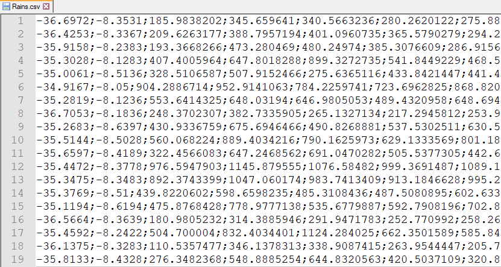

Data Pre-processing
===================

RUBEM model applications require data input at a specific format and quantity. This manual provides the steps for using the preprocessing scripts to prepare model data for the RUBEM model. The scripts described here are available in the `RUBEM repository on GitHub <https://github.com/LabSid-USP/RUBEM>`__. We recommend that you use a specific Conda environment for this step.

Conda Environment
------------------

A conda environment is used to run the scripts available for preprocessing. A :file:`conda_env.yml` file is available for creating the environment with necessary libraries and packages for running all scripts. For more details see the `related documentation. <https://conda.io/projects/conda/en/latest/user-guide/tasks/manage-environments.html#creating-an-environment-from-an-environment-yml-file>`__

Use the terminal or an Anaconda Prompt for the following steps:

1. Create the environment from the environment.yml file:

.. code-block:: console

    conda env create -f conda_env.yml

Activate the new environment:

.. code-block:: console

    conda activate myenv

Verify that the new environment was installed correctly:

.. code-block:: console

    conda env list

Available Scripts
------------------

TIFF/GeoTIFF to PCRaster Map File Format
````````````````````````````````````````

The function of the script allows to convert a file in format :file:`.tif` to a :file:`.map` file.

.. note::

    The model requires input rasters to be in PCRaster map format, each file also has to match the appropriate PCRaster value format, see :doc:`File Formats </fileformats>` for more information.

For correct output file format code, change the line 55 (``outputType``) from :file:`preprocessing/tif2map.py` must be modified according to table follows:

+-------------+--------------------+
| Soutce type | Target value scale |
+=============+====================+
| GDT_Byte    | VS_BOOLEAN         |
+-------------+--------------------+
| GDT_Int32   | VS_NOMINAL         |
+-------------+--------------------+
| GDT_Float32 | VS_SCALAR          |
+-------------+--------------------+
| GDT_Float64 | VS_SCALAR          |
+-------------+--------------------+

Call the function as shown:

.. code-block:: python

    tif2map('/path/to/files/to/be/converted')

TIFF/GeoTIFF to PCRaster Tss File Format
````````````````````````````````````````

The function of the script allows to convert a series of :file:`.tif` to pcraster map-series at format :file:`*.001`, :file:`*.002` .... These maps represent the meteorological forcing map-series, that are series of input maps with the time step indicated in each filename. The filenames have a strict format with 8 characters before a dot (.), and three characters after the dot.

Call the function as shown:

.. code-block:: python

    myModel= tif2pcrTss('/path/to/tiff/series','run','/path/to/clone.map')

First argument folder must have an structure as follows:

.. code-block:: console

    +---series
    |   etp1.tif
    |   etp2.tif
    |   etp3.tif
    ...

Define second argument as "run" output files look like follow:

.. code-block:: console

    +---series
    |   run00000.001
    |   run00000.001
    |   run00000.001
    ...


Third argument must be a file in format ``VS_BOOLEAN`` :file:`.map` and ``nrOfTimeSteps`` must match the number of files to be converted (e.g. 8 files of ``etp``, ``nrOfTimeSteps = 8``).

.. note::

    A pre-existing :file:`manifest.csv` in the output directory is removed before
    any map is written, so its presence after the run means every step
    completed; a step skipped for being entirely no-data does not leave a
    stale map at its target either.

PCRaster Tss File Format to TIFF/GeoTIFF
````````````````````````````````````````

The function of the script allows to convert a series of pcraster map-series at format :file:`*.001`, :file:`*.002` ... to :file:`*.tif` file format.

Call the function as shown:

.. code-block:: python

    pcrTss2Tif('/path/to/files/to/be/converted', '/path/to/DEM.tif')

First argument folder must have an structure as follows:

.. code-block:: console

    +---series
    |   run00000.001
    |   run00000.001
    |   run00000.001
    ...

Second argument corresponds to the Digital Elevation Model in :file:`*.tif` format used to get mask coordinates, projection and driver information for the conversion.

.. note::

    When no georeference is given, every member must still share the geometry
    of the first one; the GeoTIFF files then carry no projection. If the
    requested no-data value cannot be represented by a member's data type
    (for example, the default ``-9999`` on a Boolean or LDD map), the output
    band is promoted to the smallest type that holds both the data and the
    no-data value; a fractional no-data value is rejected on an integer
    value scale. A member is also rejected if a valid cell already equals
    the no-data value, which would otherwise make it unreadable as data on
    the next read. As above, a pre-existing :file:`manifest.csv` is removed
    before any file is written.

Get Maximum and Minimum Value Map
``````````````````````````````````

This script allows you to get a map for variables as Minimum NDVI and Maximum NDVI from an historical series of files in :file:`*.tif` format. To run the script, the following variables must be set:

.. code-block:: python

    Input_path =  'Directory containing the files'
    dem_source = 'Path to Digital Elevation Model (DEM) with same resolution and size that input_path files'
    outpath_min = 'Path and name minimum output file, example=/path/ndvi_min.tif'
    outpath_max = 'Path and name maximum output file, example=/path/ndvi_max.tif'

``Input_path`` folder must have an structure as follows:

.. code-block:: console

    +---series
    |   etp1.tif
    |   etp2.tif
    |   etp3.tif
    ...

.. note::

    ``outpath_min`` and ``outpath_max`` must not resolve to the same file, or
    the maximum would silently overwrite the minimum. The computed minimum
    and maximum are also rejected if a cell with at least one valid value in
    the series already equals the requested no-data value.

Kriging Method
``````````````

The RUBEM model uses meteorological forcing variables as precipitation and evapotranspiration. In general, meteorological data is available for specific locations (stations). This script allows you to generate spatialized maps for the variable from discrete data using the kriging method.

Call the function as shown:

.. code-block:: python

    Krige_Interpolation('/path/for/output/files/','/path/and/filename/dem.map','/path/and/filename/CSV/file/data.csv')

The first argument corresponds to the folder to store the maps generated. The second argument corresponds to the Digital Elevation Model in :file:`*.tif` format used to get mask coordinates, projection and resolution for the files created.

The third argument must be a file in format :file:`*.csv`, each row corresponds to one station data. First and second columns correspond to station Longitude and Latitude, others columns contain data for each timestep. Figure below shows an example of the format of the file.



----------

To use this script, the following conditions must be met:

- A minimum of 3 stations data is mandatory, and every station must have its
  own coordinate: two stations sharing a coordinate are rejected even when 3
  or more stations are present, because ordinary kriging cannot invert a
  system with two identical points;
- No value data is not allowed; station coordinates and values must also be
  finite (no ``nan``/``inf``);
- Projection of station coordinates must correspond to DEM projection;
- The DEM (clone) geometry must be north-up: rotated, sheared or south-up
  grids are rejected;
- ``nrOfTimeSteps`` must be minor or equal to the number of columns data;
- The variogram model must be one of ``spherical``, ``exponential`` or
  ``gaussian``, the only models both the variogram-fitting and the
  interpolation library support with the same three parameters
  (``psill``, ``range``, ``nugget``); for a geographic (longitude/latitude)
  coordinate reference system the variogram is fit with the same
  great-circle distance the interpolation uses;
- No interpolated cell may equal the requested no-data value (after the
  negative-value policy is applied), or it would be read back as missing.

Class A Pan Coefficient (Kp) Series
```````````````````````````````````

The model reads the Class A pan coefficient (:math:`kp`) as an input raster
series (see :ref:`class-a-pan-coefficient-raster-series`). When that series is
not available but the climate data behind it is, ``rubem preprocess kp`` builds
it from a wind speed series and a relative humidity series, with the formula of
the model itself:

.. math::
   :nowrap:

    \[kp = 0.482 + 0.024 \cdot \ln{(B)} - 0.000376 \cdot U_2 + 0.0045 \cdot UR \]

where:

- :math:`B` – Class A pan border width, the fetch distance, between 20 and 30 m (m);
- :math:`U_2` – average wind speed at 2 m above the ground surface (m/s);
- :math:`UR` – relative humidity (%).

Call the command as shown:

.. code-block:: console

    rubem preprocess kp --wind /path/to/u2 --humidity /path/to/ur \
        --fetch 25 -o /path/to/kp --prefix kp

The two inputs are directories of GeoTIFF files (or explicit files, repeating
``--wind`` and ``--humidity``) that form two series of the same length on the
same grid. The members are paired in natural order of their file names
(``u2_2`` before ``u2_10``): the nth wind speed raster is evaluated with the
nth relative humidity raster, and one member of the :math:`kp` series is
written per pair.

The options are:

- ``--wind``: wind speed at 2 m (m/s), a directory of GeoTIFF files or a file
  (repeatable);
- ``--humidity``: relative humidity (%), a directory of GeoTIFF files or a
  file (repeatable);
- ``--fetch``: the fetch distance :math:`B` in meters, one value for the whole
  grid; a value outside the 20 to 30 m the formula was fitted for is accepted
  with a warning;
- ``--fetch-raster``: the fetch distance in meters as a raster on the geometry
  of the series, instead of ``--fetch``; exactly one of the two is required;
- ``-o``, ``--output-dir``: where the members and ``manifest.csv`` are written;
- ``--prefix``: prefix of the member file names;
- ``--format``: ``map`` (default) writes PCRaster maps named like the other
  input series (:file:`kp000000.001`, :file:`kp000000.002`, ...), ``tif``
  writes GeoTIFF files named like the model outputs
  (:file:`kp00000001.tif`, :file:`kp00000002.tif`, ...);
- ``--first-step``: step number of the first member (default ``1``);
- ``--nodata``: missing value written to the members (default ``-9999.0``).

A cell missing in the wind speed, in the relative humidity or in the fetch
raster is missing in :math:`kp`, and the command warns about it: the model
reports a :math:`kp` member that carries missing cells, so the inputs should
cover every cell of the clone. Every member is written through a temporary
file and renamed into place, and ``manifest.csv`` is written last, with one row
per input raster (both sources of a member point at the same target), so its
presence means the run completed.

.. note::

    The model refuses a :math:`kp` raster that is not positive in every valid
    cell, as :math:`kp` divides the potential evapotranspiration. The tool
    applies the same rule: it evaluates the whole series first and, if any cell
    of any member is not positive or not finite, reports every offending member
    with its number of cells and writes nothing. Such a result usually means
    the inputs are not in the units the formula expects (wind speed at 2 m in
    m/s, relative humidity in %, fetch distance in m).

    The value range configured for the :math:`kp` input, ``[0, 1]``, is only
    reported by the model, not enforced, and the formula rises above 1 for a
    relative humidity close to 100 %: a member with cells above the maximum of
    that range is written, with a warning naming the member and the number of
    cells.

To use this command, the following conditions must be met:

- Both series must have the same number of members, and every raster must
  share the geometry (size, transform and coordinate reference system) of the
  first wind speed raster, as must the fetch raster;
- The fetch distance must be positive, as a scalar and in every valid cell of
  the fetch raster: the formula takes its logarithm;
- No valid cell may equal the requested no-data value, or it would be read
  back as missing;
- ``map`` members are written on a north-up grid with square cells, the only
  geometry the PCRaster map format expresses.
